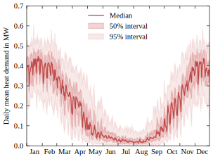
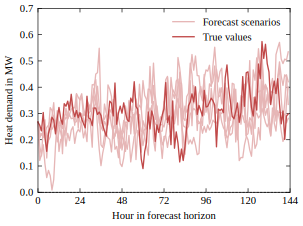

## What is `ents_casting`?

`ents_casting` generates **long-term scenarios** and matching **stochastic short-term forecasts** from measured time series of a single year and historical weather data. The generated data can be used to evaluate the design and operation of energy systems under realistic weather variability and forecast uncertainty.

The package currently supports the following time series parameters:

* `pv_local`: Capacity factor for photovoltaics.
* `wind_local`: Capacity factor for wind turbines.
* `demand_el`: Electricity demand.
* `demand_heat`: Heating demand.
* `demand_cold`: Cooling demand.
* `price_el`: Electricity price.
* `emissions_el`: Electricity emission factor.

**Input**

* Measured time series of relevant parameters for one year.

## Long-term scenarios

`ents_casting` generates long-term scenarios by learning the relationship between weather variables and the measured time series and applying this relationship to historical weather years. A synthetic error term is added to account for imperfect predictive accuracy.

Each scenario contains one year of hourly values for all supported parameters and can be used to evaluate energy system operation under different weather conditions.

<p align="center">
  
</p>

## Stochastic short-term forecasts

For every day in each long-term scenario, `ents_casting` generates a stochastic forecast with a forecast horizon of six days and hourly resolution. The forecasts are based on synthetic weather forecasts that reproduce the accuracy of historical weather forecasts.

These forecasts enable realistic simulation of operational decision making under forecast uncertainty and can be used to benchmark predictive operating methods, for example with [s2_mpc](https://github.com/RWTH-LTT/s2_mpc).

<p align="center">
  
</p>

## Installation

Clone the repository:

```bash
git clone https://github.com/RWTH-LTT/ents_casting.git
```

Create a virtual environment:

```bash
python3 -m venv ./venv_s2_mpc
```

Activate the virtual environment:

```bash
. venv_s2_mpc/Scripts/activate
```

Install `ents_casting` together with all required dependencies:

```bash
pip install -e ./ents_casting
```

---

## Getting started

### Configure `config.yaml`

The file `config.yaml` specifies all settings required for scenario and forecast generation, including the weather years, locations, and training years. All configuration options are documented in the file.

### Provide measured data

Provide the historical measured data by placing CSV files in

```text
data/measured_data/data_{year}.csv
```

where `{year}` corresponds to the years listed in `training_years` in `config.yaml`.

Different parameters may originate from different measurement years.

---

## Generate scenarios and forecasts

Run the complete workflow:

```bash
python -m ents_casting
```

The workflow performs the following steps:

1. Download the historical weather data for the specified weather years and locations.
2. Download the historical weather forecasts.
3. Train the LightGBM forecast models.
4. Generate the long-term scenarios for the specified weather years.
5. Fit AR(2) error models for the long-term scenarios.
6. Add AR(2) noise to the long-term scenarios.
7. Train the AR(2) error models for weather forecasts.
8. Train the AR(2) error models for parameter forecasts.
9. Generate the short-term forecasts for each day of the long-term scenarios.
> **Note**
>
> Downloading weather data for many (>10) weather years may exceed API rate limits. If this occurs, reduce the number of locations and download the data in multiple runs.

---

## Authors

`ents_casting` has been developed at the Institute of Technical Thermodynamics (RWTH Aachen University) by:

* Benedict Brosius
* Jan Wilberg
* Mats Zoellmann

---

## Citation

If `ents_casting` supports your research, please cite:

> Brosius, B., Zoeller, J., Zoellmann, M., Helders, S., Nilges, B., Schricker, H., & von der Assen, N. (2026). *Model predictive control of smart energy systems with seasonal storage: Mitigating the end-of-horizon effect via stochastic dynamic programming*. *Energy Conversion and Management: X*. https://doi.org/10.1016/j.ecmx.2026.102138


## License

[BSD 3-Clause License](https://github.com/RWTH-LTT/ents_casting/blob/main/LICENSE)
